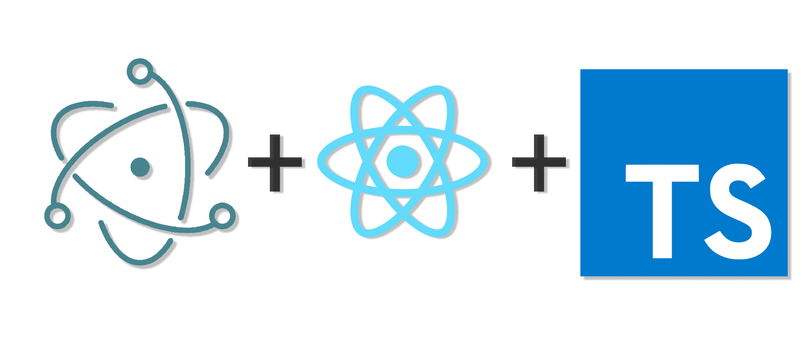

  

# Electron with React + Typescript

Electron + React + Typescript = :heart_eyes:

---

This is small boilerplate of Electron integrated of React and Typescript structure ready for development.

[Read documentation in Protuguese Version](.github/documents/README-PORTUGUESE-VERSION.md)

## Scripts available:

- [X] **start:**
Start development instance running on Electron with React.

- [X] **build:**
Create a production build of project.

- [X] **build-electron:**
Copy, create a directory and modify configuration files of electron.

- [X] **package:**
Create installer extension of project, ready of production.

- [X] **react:pure:**
Running React whitout running Electron, its best for style your pages and components in development.

---

## Instructions for create a new installer for App:

- [X] **First script: build**
Is necessary a build folder created for next steps.

- [X] **Second script: build-electron**
This script that will create a directory with the electron settings, copy the necessary files and make the appropriate modifications.

- [X] **Last script: package**
Now leave all the heavy lifting to the electron-builder, he will do all the necessary steps to create a quick and practical installer for your application.

---

:mega: **WARNING:**
In src/utils/prepareFilesToPackage.js this file is a script build-electron **DON'T EXCLUDE THIS FILE!** or your package script smash your app.

Doubts? contact me!

:mailbox: matheus.rj.ig@gmail.com